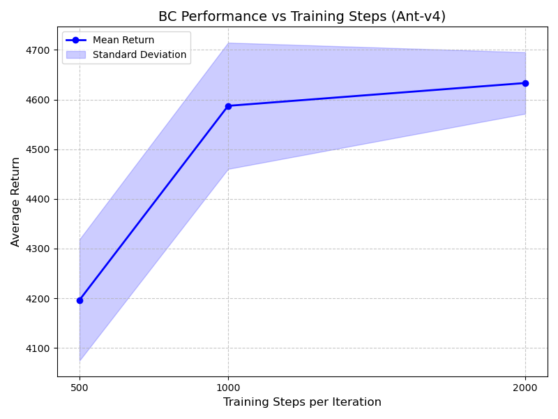
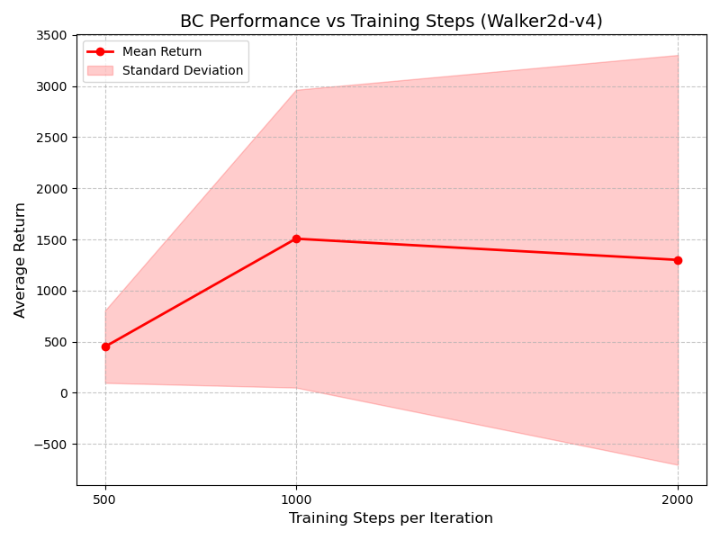

# Behavioral Cloning Results and Analysis

## 1. Task Performance Comparison

The following table summarizes the performance of the behavioral cloning (BC) agent on two different tasks: **Ant-v4** (Working) and **Walker2d-v4** (Not Working).

| Task | Expert Mean | Policy Mean | Policy Std | Performance Ratio |
| :--- | :--- | :--- | :--- | :--- |
| **Ant-v4** | 4681.89 | 4587.31 | 127.16 | **98.0%** |
| **Walker2d-v4** | 5383.31 | 1506.97 | 1456.65 | **28.0%** |

*Table 1: Performance comparison between Ant-v4 and Walker2d-v4. Both experiments used `n_iter=1`, `train_batch_size=100`, and `num_agent_train_steps_per_iter=1000`. `eval_batch_size` was set to 5000 to collect multiple rollouts (approx. 5 trajectories) for robust standard deviation calculation.*

### Analysis

- **Ant-v4 (Working)**: The BC agent achieved an average return of **4587.31**, which is **98.0%** of the expert's performance (4681.89). The low standard deviation (**127.16**) across multiple rollouts confirms that the learned policy is stable and robust. The task requirement of achieving at least 30% performance was easily met.

- **Walker2d-v4 (Not Working)**: The BC agent achieved an average return of **1506.97**, which is only **28.0%** of the expert's performance (5383.31). This falls below the 30% threshold, qualifying it as the "failure" case. The high standard deviation (**1456.65**) and the large gap between `Eval_MaxReturn` (4690.17) and `Eval_MinReturn` (208.66) suggest that the policy is highly unstable. While it occasionally performs well, it frequently fails catastrophically (likely falling over early, as indicated by the low `Eval_AverageEpLen` of 353.6 vs the max 1000). This instability is characteristic of the "distribution shift" problem in behavioral cloning, where small errors accumulate and drive the agent into states it hasn't seen in the expert data.

## 2. Hyperparameter Experiment

In this section, we investigate the effect of the number of training steps per iteration (`num_agent_train_steps_per_iter`) on the performance of the behavioral cloning agent.

**Hyperparameter**: `num_agent_train_steps_per_iter`

**Values Tested**: 500, 1000, 2000

**Rationale**: This parameter controls how many gradient updates are performed on the expert data.

- **Too few steps (e.g., 500)** may lead to **underfitting**, where the network hasn't fully learned the expert's mapping from observations to actions.
- **More steps (e.g., 2000)** allow for better fitting of the training data. For simple tasks like Ant-v4, this usually improves performance and stability. For harder tasks like Walker2d-v4, it might improve peak performance but doesn't necessarily solve the distribution shift problem (instability remains).

### Results

We conducted the experiment on both **Ant-v4** (the stable task) and **Walker2d-v4** (the unstable task).

#### Table 2: Effect of Training Steps on Ant-v4

| Training Steps | Eval Mean Return | Eval Std Return | Performance Ratio |
| :--- | :--- | :--- | :--- |
| **500** | 4196.36 | 122.10 | 89.6% |
| **1000** | 4587.31 | 127.16 | 98.0% |
| **2000** | 4633.28 | 61.89 | **99.0%** |

#### Table 3: Effect of Training Steps on Walker2d-v4

| Training Steps | Eval Mean Return | Eval Std Return | Performance Ratio |
| :--- | :--- | :--- | :--- |
| **500** | 450.32 | 354.10 | 8.4% |
| **1000** | 1506.97 | 1456.65 | **28.0%** |
| **2000** | 1299.48 | 2004.38 | 24.1% |

### Analysis and Conclusion

**Ant-v4**:
As expected, increasing the number of training steps consistently improves performance.

- **500 steps** resulted in a decent but slightly sub-optimal policy (~90% expert performance).
- **2000 steps** achieved near-perfect expert performance (**99%**) with the lowest standard deviation (**61.89**), indicating a very stable policy. This confirms that for this task, more training helps the model converge closer to the expert's behavior without overfitting issues.

**Walker2d-v4**:
The results here are more interesting and highlight the challenges of behavioral cloning.

- **500 steps**: Severe underfitting. The agent barely functions (8.4% performance).
- **1000 steps**: Significant improvement to **28.0%**, but with huge variance (Std: 1456).
- **2000 steps**: Performance actually **dropped slightly** to 24.1%, and variance exploded (Std: 2004). This suggests that simply training *more* on the same static dataset doesn't solve the fundamental distribution shift problem. The agent might be "overfitting" to the specific trajectories in the expert dataset, making it even more brittle when it inevitably drifts off-distribution during evaluation.

### Performance Graphs

We visualize the effect of training steps on agent performance below. The shaded regions represent the standard deviation.

#### Ant-v4 (Stable)

The trend for Ant-v4 clearly shows a positive correlation between training steps and agent return, saturating as it approaches expert performance. As steps increase, the variance (shaded area) decreases, indicating a more stable policy.

#### Walker2d-v4 (Unstable)

For Walker2d-v4, the graph illustrates the instability. While mean performance peaks at 1000 steps, the massive standard deviation (large shaded area) indicates that the policy is unreliable. At 2000 steps, the performance does not improve and the variance remains extremely high, confirming that simply training longer does not fix the distribution shift issue in this harder environment.
